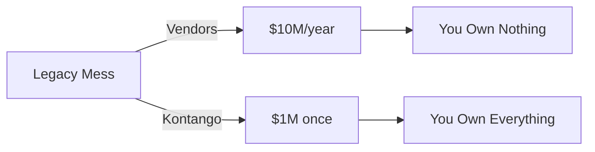

## 30-Second Pitches by Customer Segment

---

### 🔧 **Blue Collar Companies**
*"Your software costs more than your equipment, and your workers hate using it."*

```
Before: $500K/year → Silicon Valley
After:  $50K/year  → Your business

That's 10 new trucks. Or 8 skilled workers. Your choice.
```

**"We're Kontango - we build enterprise tech that works like your crew does: reliable, no BS, gets the job done. Fortune 500 infrastructure at blue-collar prices. Your field workers actually tested it, so your field workers will actually use it. Stop sending your equipment budget to Silicon Valley. *Your e-waste, our enterprise cloud.***

*Making Oracle nervous since 2024. 🛠️*

---

### 🚀 **Digital Transformation Leaders**
*"Still paying millions to 'transform'? That's not transformation, that's a subscription."*



**"Kontango builds enterprise infrastructure from open source and ingenuity. We're talking 50,000 requests/second, 99.97% uptime, Kubernetes at scale - except you OWN it. No vendor lock-in. No annual increases. No consultants. We transform your infrastructure in 8 weeks for what AWS charges in 8 days. *We put big tech in backwardation.***

*Ctrl+Alt+Delete your infrastructure costs. 💾*

---

### 🏛️ **Digital Sovereignty Advocates**
*"Your data. Your infrastructure. Your rules. No backdoors."*

```
🏢 Your Data → ☁️ Their Servers → 🏛️ Their Jurisdiction → 🚪 Their Backdoors
      ↓
🏢 Your Data → 🏠 Your Servers → 🏛️ Your Jurisdiction → 🔒 Your Control
```

**"Kontango builds sovereign clouds from 100% open source - every line auditable, every component yours. No phone-home licenses, no vendor surveillance, no surprise ToS changes. Run it in your country, under your laws, with your security. We've built sovereign infrastructure for organizations who can't trust Silicon Valley with their citizens' data. *Own your stack, own your future.***

*404: Vendor surveillance not found. 🗽*

---

### 🛠️ **Makers & Builders**
*"Remember when the internet was fun and you could fix things?"*

```bash
# Traditional Enterprise
$ license --renew --cost "your_soul"
ERROR: Vendor lock-in detected

# Kontango Way  
$ git clone freedom
$ docker-compose up dreams
SUCCESS: You own everything
```

**"Kontango is what happens when makers grow up but refuse to sell out. We build Fortune 500 infrastructure from GitHub repos and garage sales. Everything's open source, infinitely hackable, runs on anything with electrons. Join the fellowship of chaos engineers who think building > buying. We're not saying we're the Mad Hatters of infrastructure, but... *actually yeah, we are.***

*Hold my Red Bull and watch this. ⚡*

---

## The Universal 10-Second Drop

**"Kontango. We build million-dollar infrastructure from free software and scraps. We're really good at it. Probably the best. Want to see?"**

*[Pull out phone showing dashboard]*

**"That's a Fortune 500 enterprise cloud running on servers we saved from recycling. Questions?"**

---

## The Mic Drop for Each

**Blue Collar:** "Your software budget could hire 10 workers. Call us."

**Digital Transformation:** "Transform once. Own forever. Never pay again."

**Digital Sovereignty:** "Your country. Your cloud. Your control."

**Makers:** "We made enterprise infrastructure fun again. You're welcome."