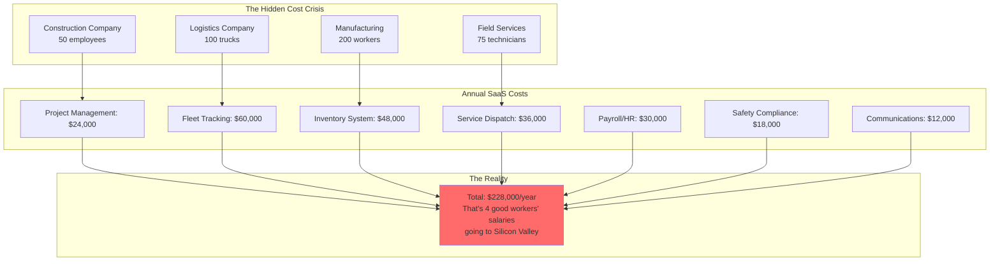
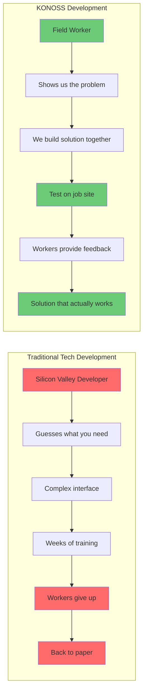
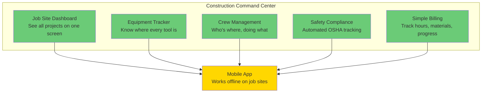
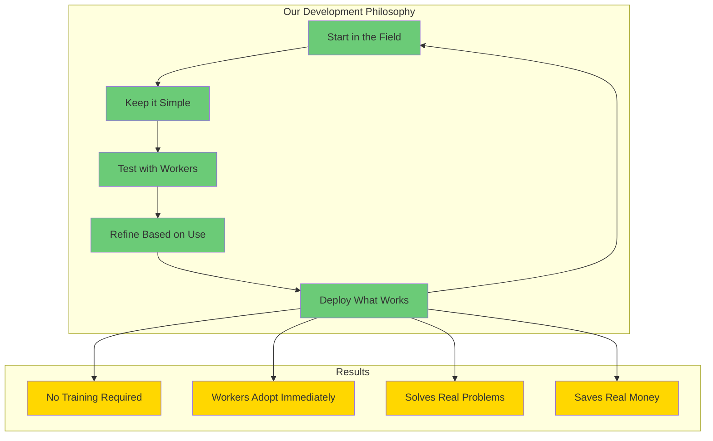
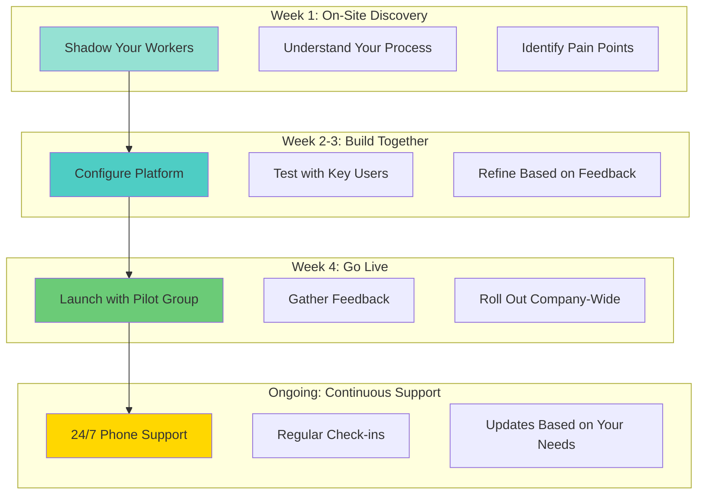
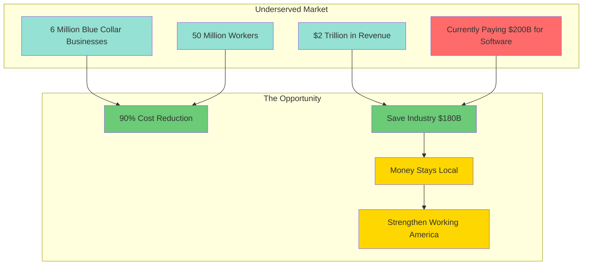
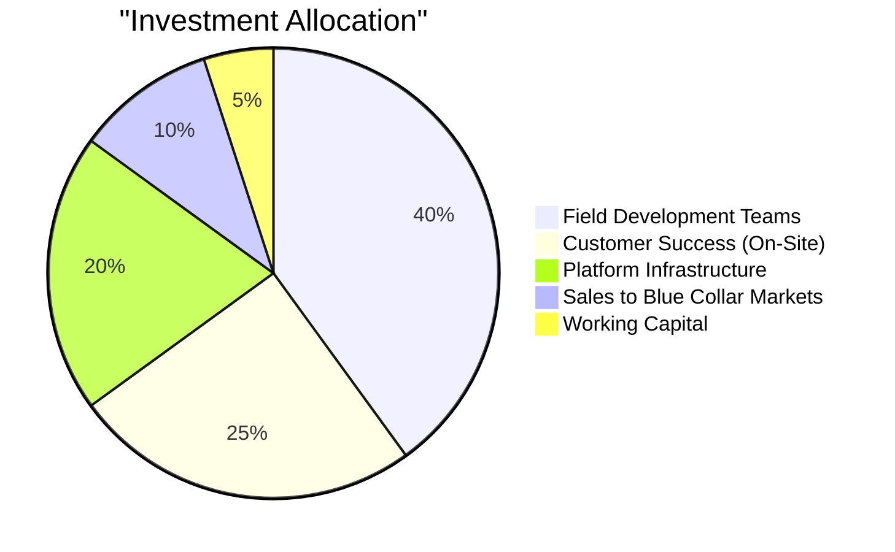

# KONOSS: Technology Built BY Working People, FOR Working People

## Enterprise-Grade Infrastructure for the Backbone of America

---

## Executive Summary

**KONOSS (Kontango Open Source Solutions)** isn't another Silicon Valley tech company building tools they'll never use. We're blue-collar technologists who got tired of watching working businesses get priced out of modern technology. 

We built our platform in the field, alongside contractors, manufacturers, logistics companies, and the businesses that keep America running. Every feature has been tested on job sites, in warehouses, and on factory floors.

### Our Mission

**Democratize enterprise technology for working America** - because the company managing 500 trucks shouldn't pay more for software than they do for diesel.

### The Bottom Line

- **90% Cost Reduction** - More money for wages, equipment, and growth
- **Built in the Field** - Every feature tested by actual workers
- **No Tech Degree Required** - Interfaces your team can actually use
- **24/7 Support** - From people who understand your business
- **100% Open Source** - You own it, forever. No subscriptions, no surprises.

---

## The Problem: Working Businesses Getting Squeezed

### The SaaS Tax on Blue Collar America



### Real Stories from Real Businesses

**Midwest Trucking Company**: 
- Paying $5,000/month for fleet management software
- Another $3,000/month for dispatch system
- $2,000/month for driver communication app
- **$120,000/year that could hire two more drivers**

**Regional Construction Firm**:
- 15 different software subscriptions
- None of them talk to each other
- Field workers need 6 apps on their phones
- **Spending more on software than equipment leases**

**Manufacturing Plant**:
- ERP system costs more than raw materials
- Need IT consultant just to run reports
- Workers bypass system, use paper instead
- **"Technology" making them less efficient**

---

## Our Solution: Built BY Workers, FOR Workers

### Field-Tested, Worker-Approved

We didn't build KONOSS in a Silicon Valley office. We built it on job sites, in truck cabs, and on factory floors. Every feature has been tested by the people who actually use it.



### Technology Stack That Works for Working People

| What You Need | What They Sell You | What We Built | Monthly Savings |
|---------------|-------------------|---------------|-----------------|
| **Track Equipment** | Complex GPS system ($500/month) | Simple map, real-time location | **$500** |
| **Manage Projects** | Complicated Gantt charts ($2,000/month) | Visual boards workers understand | **$2,000** |
| **Schedule Workers** | HR software suite ($1,500/month) | Drag-and-drop scheduling | **$1,500** |
| **Track Inventory** | Enterprise ERP ($5,000/month) | Barcode scanning that works | **$5,000** |
| **Communicate** | Multiple apps ($500/month) | One simple system | **$500** |
| **Safety/Compliance** | Consultant + software ($3,000/month) | Automated compliance tracking | **$3,000** |
| **Customer Management** | Complex CRM ($1,000/month) | Simple customer tracker | **$1,000** |
| **Total Monthly** | **$13,500** | **$1,350** | **$12,150 saved** |

---

## Industry Solutions: Real Tools for Real Work

### Construction & Contracting

**The Challenge**: 
- Managing multiple job sites
- Tracking equipment across projects
- Coordinating subcontractors
- Meeting compliance requirements

**The KONOSS Solution**:


**Real Results**:
- Plumbing contractor: Cut project delays by 40%
- General contractor: Reduced equipment loss by 75%
- Electrical contractor: Eliminated paper timesheets
- **Average savings: $8,000/month**

### Transportation & Logistics

**The Challenge**:
- Fleet tracking and maintenance
- Driver hours compliance
- Route optimization
- Customer communication

**The KONOSS Solution**:
- Real-time fleet visibility (no expensive GPS units)
- Automated HOS tracking and alerts
- Smart routing that drivers actually follow
- Customer text updates (no app required)

**Real Results**:
- Regional carrier: Saved $100K/year on software
- Local delivery: Increased deliveries by 30%
- Long-haul trucking: 100% DOT compliance
- **Fuel savings alone cover the entire platform cost**

### Manufacturing & Warehousing

**The Challenge**:
- Inventory accuracy
- Production tracking
- Quality control
- Worker safety

**The KONOSS Solution**:
- Simple barcode/QR code scanning
- Visual production boards
- Quality checks workers can't skip
- Real-time safety monitoring

**Real Results**:
- Metal fabricator: 95% inventory accuracy (up from 70%)
- Food processor: Reduced waste by 25%
- Parts distributor: Cut picking errors by 80%
- **ROI in less than 90 days**

### Field Services

**The Challenge**:
- Scheduling technicians
- Managing service calls
- Parts inventory
- Customer billing

**The KONOSS Solution**:
- Drag-and-drop scheduling
- Mobile app that works everywhere (even no signal)
- Photo-based parts ordering
- Invoice on the spot

**Real Results**:
- HVAC company: 20% more calls per day
- Plumbing service: Eliminated double-booking
- Electrical service: First-time fix rate up 35%
- **Technicians actually like using it**

---

## The Blue Collar Advantage

### Why Working People Build Better Technology



### Our Testing Process

1. **Morning Coffee Test**: Can you figure it out before your first coffee?
2. **Dirty Hands Test**: Can you use it with work gloves on?
3. **Truck Cab Test**: Does it work on a phone in a moving vehicle?
4. **End of Day Test**: Is it faster than paper at 5 PM on Friday?
5. **New Guy Test**: Can the newest hire use it on day one?

If it doesn't pass ALL these tests, we don't ship it.

---

## Financial Impact: Money Back in Your Pocket

### Real Company, Real Savings

**Regional Construction Company (150 employees)**

| Category | Before KONOSS | After KONOSS | Annual Savings |
|----------|---------------|--------------|----------------|
| Project Management | $36,000 | $3,600 | $32,400 |
| Fleet Management | $48,000 | Included | $48,000 |
| Time Tracking | $18,000 | Included | $18,000 |
| Safety Compliance | $24,000 | Included | $24,000 |
| Communications | $12,000 | Included | $12,000 |
| Inventory | $30,000 | Included | $30,000 |
| IT Support | $60,000 | $12,000 | $48,000 |
| **Total Annual** | **$228,000** | **$15,600** | **$212,400** |

**That's enough to:**
- Hire 4 skilled workers
- Buy 2 new work trucks
- Upgrade all equipment
- Give everyone raises

### 5-Year Impact Analysis

```mermaid
graph LR
    subgraph "Traditional SaaS Path"
        Y1A[Year 1: $228K]
        Y2A[Year 2: $251K<br/>(10% increase)]
        Y3A[Year 3: $276K]
        Y4A[Year 4: $304K]
        Y5A[Year 5: $334K]
        TOTALA[5-Year Total:<br/>$1,393,000]
    end
    
    subgraph "KONOSS Path"
        Y1B[Year 1: $15.6K]
        Y2B[Year 2: $15.6K<br/>(No increase)]
        Y3B[Year 3: $15.6K]
        Y4B[Year 4: $15.6K]
        Y5B[Year 5: $15.6K]
        TOTALB[5-Year Total:<br/>$78,000]
    end
    
    subgraph "Your Savings"
        SAVE[5-Year Savings:<br/>$1,315,000<br/>That's a whole lot of<br/>trucks, tools, and bonuses]
    end
    
    TOTALA --> SAVE
    TOTALB --> SAVE
    
    style TOTALA fill:#FF6B6B
    style TOTALB fill:#6BCB77
    style SAVE fill:#FFD700
```

---

## Implementation: We Come to You

### On-Site Deployment

We don't do implementations from ivory towers. We come to your job site, your warehouse, your office. We set it up alongside your team, making sure it works for YOUR business.



### Training That Actually Works

- **No Manuals**: If it needs a manual, we built it wrong
- **Peer Training**: Your best worker shows others
- **Job-Site Support**: We're there when you need us
- **Video Guides**: 2-minute videos, not 2-hour webinars

---

## Our Team: Blue Collar Technologists

### We're Not Your Typical Tech Company

Our team isn't fresh computer science grads who've never held a tool. We're:

- Former contractors who learned to code
- Military veterans who understand logistics
- Field service techs who got tired of bad software
- Manufacturing workers who automated their own jobs
- Small business owners who solved their own problems

**We've been in your boots. We know what it's like to:**
- Start work before sunrise
- Deal with equipment breakdowns
- Manage crews in multiple locations
- Meet tight deadlines with tighter budgets
- Come home exhausted but proud of what we built

### Our Development Philosophy

> "If a tired worker at the end of a 12-hour shift can't use it instantly, we failed."

---

## Success Stories: Real Companies, Real Results

### Case Study: Johnson Excavation

**Background**: 
- 3rd generation family business
- 75 employees
- Struggling with 8 different software systems

**Challenge**: 
- Spending $15K/month on software
- Workers refusing to use complicated systems
- Back to whiteboards and paper

**Solution**:
- KONOSS replaced all 8 systems
- One simple interface for everything
- Tested by their own crews

**Results**:
- **$13K/month savings**
- **100% worker adoption in 2 weeks**
- **30% increase in job completion rate**
- **"First software my guys actually like"** - Owner

### Case Study: Regional Freight Lines

**Background**:
- 200 trucks
- 300 drivers
- Multi-state operation

**Challenge**:
- Complex TMS costing $20K/month
- Drivers couldn't figure out mobile app
- Compliance nightmares

**Solution**:
- Simple tracking and dispatch
- Text-based driver communication
- Automated compliance reporting

**Results**:
- **$18K/month savings**
- **Zero compliance violations**
- **Drivers prefer it to paper logs**
- **Dispatchers cut workload in half**

### Case Study: Precision Metal Works

**Background**:
- Custom fabrication shop
- 50 employees
- Just-in-time manufacturing

**Challenge**:
- ERP system required full-time IT person
- Floor workers bypassed system
- Inventory always wrong

**Solution**:
- Simple tablet-based tracking
- QR codes on everything
- Visual production boards

**Results**:
- **Eliminated IT position ($70K/year)**
- **Inventory accuracy: 70% → 98%**
- **On-time delivery: 65% → 92%**
- **Workers actually update the system**

---

## The Market Opportunity

### Serving the Backbone of America



### Why Now?

1. **SaaS Fatigue**: Businesses tired of subscription creep
2. **Worker Shortage**: Need technology that makes workers more efficient
3. **Margin Pressure**: Every dollar counts in competitive markets
4. **Generational Change**: New generation of blue collar leaders ready for better tech

---

## Investment Opportunity

### Building the Platform for Working America

**Our Vision**: Be the technology backbone for 1 million blue collar businesses by 2030

**Why We'll Win**:
- We understand the customer (we ARE the customer)
- 90% cost advantage is unbeatable
- Field-tested beats conference room designed
- Open source means no vendor lock-in
- Blue collar businesses trust other blue collar businesses

### Use of Investment



### Financial Projections

| Milestone | Customers | ARR | Customer Profile |
|-----------|-----------|-----|------------------|
| Year 1 | 100 | $2M | Local contractors |
| Year 2 | 500 | $10M | Regional companies |
| Year 3 | 2,000 | $40M | Multi-state operations |
| Year 4 | 5,000 | $100M | Industry associations |
| Year 5 | 10,000 | $200M | National platform |

**Unit Economics**:
- Average Customer: 50 employees
- Monthly Revenue per Customer: $1,500
- Gross Margin: 85%
- Customer Lifetime: 10+ years
- **LTV:CAC Ratio: 15:1**

---

## Call to Action

### Join the Blue Collar Technology Revolution

**For Blue Collar Businesses**:
Stop sending your hard-earned money to Silicon Valley. Get technology built by people who understand your business.

**30-Day Guarantee**: If KONOSS doesn't save you money AND make your life easier, we'll refund everything and help you switch back.

**For Investors**:
This isn't disruption. This is serving a massive, underserved market that's desperate for solutions.

- 6 million potential customers
- $200B being wasted on overpriced software
- Customers who value loyalty and relationships
- Recession-resistant industries

**For Partners**:
- Industry associations: Provide member value
- Equipment dealers: Add software to your offering
- Trade schools: Prepare workers for modern jobsites
- Unions: Strengthen your members' businesses

---

## Get Started Today

### Three Ways to Experience KONOSS

1. **Free Trial**
   - 30 days, no credit card
   - We'll come to your site to set it up
   - Use your real data and processes

2. **Proof of Value**
   - We'll implement one critical workflow
   - Show ROI before you commit
   - Money-back guarantee

3. **Industry Partnership**
   - Special pricing for associations
   - Customization for your industry
   - Your members save millions collectively

### Contact Us

**Call**: 1-800-KONOSS1 (Talk to a real person who understands your business)

**Email**: info@konoss.io

**Visit**: Schedule an on-site demo at your location

**Partner**: Bring KONOSS to your entire industry

---

## Our Promise

We're not another tech company trying to sell you something you don't need. We're working people who built the tools we wished we had.

**Our Commitment**:
- If it doesn't work in the field, we fix it
- If workers won't use it, we rebuild it
- If it doesn't save you money, you don't pay
- Your success is our success

---

<div align="center">

# **KONOSS**
## Kontango Open Source Solutions

### Technology FOR Working People, BY Working People

*"We're not disrupting your industry.*
*We're giving you the tools to dominate it."*

---

**Built in the USA 🇺🇸 | Tested on Job Sites | Proven in the Field**

**Stop paying Silicon Valley. Start investing in your business.**

</div>